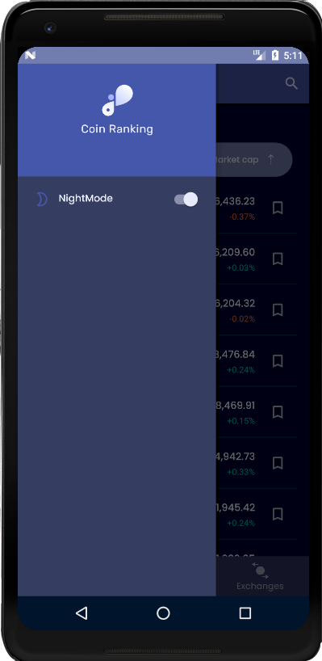

# Coin Ranking

Coin Rnaking is the final project of anrdroid internship course at Part software group.

### Overview

This project includes digital money and currency exchange rates letting you manage them all in a single screen. In addition the app includes historic rate charts which you can stay up to date with most important cryptocurrencies like Bitcoin, Ethereum, Ripple, Stellar, Cardano and much more.
our apps features:
- Historic graph prices: track cryptocurrencies over time.
- Functional design, easy to read and multi-theme, for day and night.
- Fast and simple usage that you'll be able to exchange conversions in just a couple of seconds.
- Convert multiple currencies at once.

we will constantly update our app to support a wider range of currencies.

